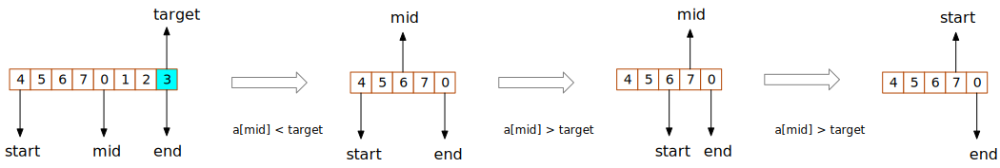

# 153. 寻找旋转排序数组中的最小值
假设按照升序排序的数组在预先未知的某个点上进行了旋转。  

( 例如，数组 [0,1,2,4,5,6,7] 可能变为 [4,5,6,7,0,1,2] )。  

请找出其中最小的元素。  

你可以假设数组中不存在重复元素。  
示例 1:
```
输入: [3,4,5,1,2]
输出: 1
```
示例 2:
```
输入: [4,5,6,7,0,1,2]
输出: 0
```

```go
func findMin(nums []int) int {
}
```

## 解题思路
二分查找  


## 题解

```go
func findMin(nums []int) int {
    
    start := 0
    end := len(nums) - 1
    
    target := nums[end]
    
    for start + 1 < end  {
        mid := start + (end - start) / 2
        
        if nums[mid] > target {
            start = mid
        } else {
            end = mid
        }
    }
    
    if nums[start] > nums[end] {
        return nums[end]
    }
    
    return nums[start]
    
}

```
