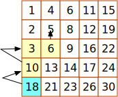

# 240. 搜索二维矩阵 II
编写一个高效的算法来搜索 m x n 矩阵 matrix 中的一个目标值 target。该矩阵具有以下特性：
- 每行的元素从左到右升序排列。
- 每列的元素从上到下升序排列。

示例:  
现有矩阵 matrix 如下：

```
[
  [1,   4,  7, 11, 15],
  [2,   5,  8, 12, 19],
  [3,   6,  9, 16, 22],
  [10, 13, 14, 17, 24],
  [18, 21, 23, 26, 30]
]
```


```go
func searchMatrix(matrix [][]int, target int) bool {
}
```

## 解题思路
和搜索二维矩阵不太一样，没办法通过直接通过二分查找  
左下 --> 右上 检索  



## 题解

```go
func searchMatrix(matrix [][]int, target int) bool {
    row := len(matrix) - 1
    if row == -1 {
        return false
    }
    
    col := len(matrix[0]) - 1
    colNum := 0
    
    for row >= 0 && colNum <= col {
        if matrix[row][colNum] > target {
            row--
        } else if matrix[row][colNum] < target {
            colNum++
        } else {
            return true
        }
    }
    
    return false
}
```
