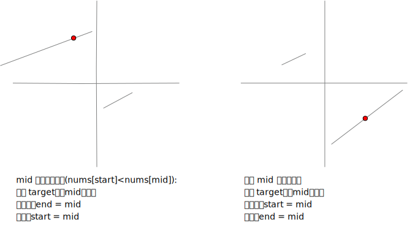

# 33. 搜索旋转排序数组
假设按照升序排序的数组在预先未知的某个点上进行了旋转。  

( 例如，数组 [0,1,2,4,5,6,7] 可能变为 [4,5,6,7,0,1,2] )。  

搜索一个给定的目标值，如果数组中存在这个目标值，则返回它的索引，否则返回 -1 。  

你可以假设数组中不存在重复的元素。  

你的算法时间复杂度必须是 O(log n) 级别。  

```go
func search(nums []int, target int) int {
}
```

## 解题思路
二分法的变形  




## 题解

```go
func search(nums []int, target int) int {

    if len(nums) <= 0 {
        return -1
    }
    
    start := 0
    end := len(nums) -1 
    
    for start + 1 < end {
        
        mid := start + (end - start) / 2    // 防止溢出 = (start + end) / 2
        
        if nums[start] < nums[mid] {
            
            if nums[start] <= target && nums[mid] >= target {
               end = mid
            } else {
               start = mid
            }
        } else {
            if nums[end] >= target && nums[mid] <= target {
               start = mid
            } else {
                end = mid
            }
        }
    }
    
    if nums[start] == target {
        return start
    }
    if nums[end] == target {
        return end
    }
    return -1
    
}
```
