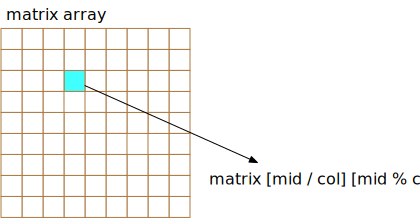

# 74. 搜索二维矩阵
编写一个高效的算法来判断 m x n 矩阵中，是否存在一个目标值。该矩阵具有如下特性：  

- 每行中的整数从左到右按升序排列。
- 每行的第一个整数大于前一行的最后一个整数。

示例 1:
```
输入:
matrix = [
  [1,   3,  5,  7],
  [10, 11, 16, 20],
  [23, 30, 34, 50]
]
target = 3
输出: true
```
示例 2:
```
输入:
matrix = [
  [1,   3,  5,  7],
  [10, 11, 16, 20],
  [23, 30, 34, 50]
]
target = 13
输出: false
```


```go
func searchMatrix(matrix [][]int, target int) bool {
}
```

## 解题思路
和普通二分查找区别: 在二维数组中检索  
计算中间的下标就可以了


## 题解

```go
func searchMatrix(matrix [][]int, target int) bool {
    
    row := len(matrix)
    if row == 0 {
        return false
    }
    
    col := len(matrix[0])
    if col == 0 { 
        return false
    }
    
    start := 0
    end := row * col - 1
    
    for start <= end {
        
        mid := start + (end -start) /2
        val := matrix[mid / col][mid % col]
        
        if target == val {
            return true
        }
        if val > target {
            end = mid - 1
        } else {
            start = mid + 1
        }
    }
    return false
}

```
