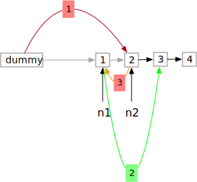

# 24. 两两交换链表中的节点
给定一个链表，两两交换其中相邻的节点，并返回交换后的链表。  

你不能只是单纯的改变节点内部的值，而是需要实际的进行节点交换。  

 

示例:
```
给定 ```1->2->3->4```, 你应该返回 ```2->1->4->3```.
```


```go
func swapPairs(head *ListNode) *ListNode {
}
```

## 解题思路


## 题解
```go
func swapPairs(head *ListNode) *ListNode {

    dummyNode := &ListNode {
        Next: head,
    }
    head = dummyNode
    for head.Next != nil && head.Next.Next != nil {
        n1 := head.Next
        n2 := head.Next.Next

        head.Next = n2
        n1.Next = n2.Next
        n2.Next = n1

        head = n1

    }
    return dummyNode.Next
}
```
