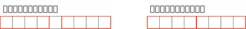

# 409. 最长回文串
给定一个包含大写字母和小写字母的字符串，找到通过这些字母构造成的最长的回文串。  

在构造过程中，请注意区分大小写。比如 "Aa" 不能当做一个回文字符串。  

注意:
假设字符串的长度不会超过 1010。  

示例 1：
```
输入:
"abccccdd"

输出:
7

解释:
我们可以构造的最长的回文串是"dccaccd", 它的长度是 7。
```

```go
func longestPalindrome(s string) int {
}
```

## 解题思路
如果是字符是偶数个，统计直接 +n  
如果是字符是奇数个，判断如果最长是偶数个，需要 +1  



##

```go
func longestPalindrome(s string) int {
    
    counts := make([]int,128)
    for _,char := range s {
        counts[char]++
    }
    
    ans := 0
    for _,v := range counts {
        ans += v / 2 * 2
        
        if v % 2 == 1 && ans % 2 == 0 {
            ans++
        }
    }
    
    return ans
}
```
