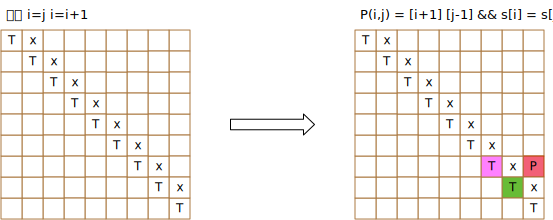

# 5. 最长回文子串
给定一个字符串 s，找到 s 中最长的回文子串。你可以假设 s 的最大长度为 1000。

示例 1：
```
输入: "babad"
输出: "bab"
注意: "aba" 也是一个有效答案。
```

示例 2：
```
输入: "cbbd"
输出: "bb"

```

```go
func longestPalindrome(s string) string {
}
```

## 解题思路
动态规划，使用一个二维数组标记[i,j]是不是一个回文串



step.1 初始化 i=i i=i+1  
step.2 计算

## 题解

```go
func longestPalindrome(s string) string {

    length := len(s)
    if length == 0 {
        return ""
    }

    // init dp status array
    stats := make([][]bool, length)
    for i := 0; i < length; i++ {
        stats[i] = make([]bool, length)
    }

    // step.1 calculate i = i && i == i+1
    for i := 0; i < length; i++ {
        stats[i][i] = true
    }

    start := 0
    max := 1
    for i := 0; i < length-1; i++ {
        if s[i:i+1] == s[i+1:i+2] {
            stats[i][i+1] = true
            start = i
            max = 2
        }
    }

    // step.2 calculate
    for i := length - 2; i >= 0; i-- {
        for j := i + 2; j < length; j++ {
            if stats[i+1][j-1] && s[i:i+1] == s[j:j+1] {
                stats[i][j] = true
                if j-i+1 > max {
                    start = i
                    max = j - i + 1
                }
            }
        }
    }

    return s[start : start+max]
}
```