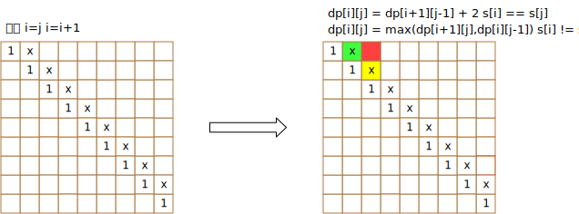

# 516. 最长回文子序列
给定一个字符串s，找到其中最长的回文子序列。可以假设s的最大长度为1000。  

示例 1:  
输入:  
```
"bbbab"
```
输出:  
```
4
```
一个可能的最长回文子序列为 "bbbb"。

示例 2:  
输入:  
```
"cbbd"
```
输出:  
```
2
```

```go
func longestPalindromeSubseq(s string) int {
}
```

## 解题思路
动态规划，和leetcode.5类似



## 题解

### 自顶向下
```go
func longestPalindromeSubseq(s string) int {
    length := len(s)
    
    if length <= 1 {
        return length
    }
    
    // init array
    dp := make([][]int, length)
    for idx := range dp {
        dp[idx] = make([]int, length)
    }
    
    // init [i][i]
    for i := 0; i < length; i++ {
        dp[i][i] = 1
    }
    
    // init [i][i+1]
    for i := 0; i< length -1; i++ {
        if s[i:i+1] == s[i+1:i+2] {
            dp[i][i+1] = 2
        } else {
            dp[i][i+1] = 1
        }
    }
    
    // 自顶向下
    for n := 3; n <= length; n++ {
        for i := 0; i <= length - n; i++ {
            j := i + n - 1
            dp[i][j] = dp[i][j-1]
            if dp[i][j-1] < dp[i+1][j] {
                dp[i][j] = dp[i+1][j]
            }
            if s[i:i+1] == s[j:j+1] && dp[i+1][j-1] +2 > dp[i][j] {
                dp[i][j] = dp[i+1][j-1] + 2
            }
        }
    }
    
    // 查找最大
    rst := 0
    for _,row := range dp {
        for _,col := range row {
            if rst < col {
                rst = col
            }
        }
    }
    
    return rst
    
}
```

### 自底向上
```go
func longestPalindromeSubseq(s string) int {
    
    length := len(s)
    if length <= 1 {
        return length
    }
    
    // init array
    dp := make([][]int, length)
    for idx := range dp {
        dp[idx] = make([]int, length)
    }
    
    for i := length -1; i >= 0; i-- {
        dp[i][i] = 1
        for j := i + 1; j < length; j++ {
            if s[i:i+1] == s[j:j+1] {
                dp[i][j] = dp[i+1][j-1] + 2
            } else {
                dp[i][j] = max(dp[i+1][j], dp[i][j-1])
            }
        }
    }
    return dp[0][length-1]
}

func max(n1 int, n2 int) int {
    if n1 > n2 {
        return n1
    }
    return n2
}

```
